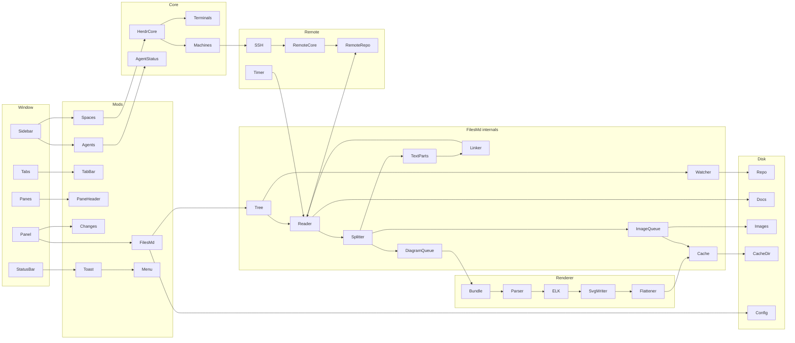

# Architecture

The main scenario: an architecture document an agent wrote, with a 40-node flowchart.

```mermaid
flowchart LR
  subgraph Window["Window"]
    Sidebar[Sidebar]
    Tabs[Tabs]
    Panes[Panes]
    StatusBar[StatusBar]
    Panel[Panel]
  end
  subgraph Mods["Mods"]
    Spaces[Spaces]
    Agents[Agents]
    TabBar[TabBar]
    PaneHeader[PaneHeader]
    FilesMd[FilesMd]
    Changes[Changes]
    Toast[Toast]
    Menu[Menu]
  end
  subgraph FilesMd_internals["FilesMd internals"]
    Tree[Tree]
    Watcher[Watcher]
    Reader[Reader]
    Splitter[Splitter]
    TextParts[TextParts]
    DiagramQueue[DiagramQueue]
    ImageQueue[ImageQueue]
    Cache[Cache]
    Linker[Linker]
  end
  subgraph Renderer["Renderer"]
    Bundle[Bundle]
    Parser[Parser]
    ELK[ELK]
    SvgWriter[SvgWriter]
    Flattener[Flattener]
  end
  subgraph Core["Core"]
    HerdrCore[HerdrCore]
    Terminals[Terminals]
    AgentStatus[AgentStatus]
    Machines[Machines]
  end
  subgraph Disk["Disk"]
    Repo[Repo]
    Docs[Docs]
    Images[Images]
    CacheDir[CacheDir]
    Config[Config]
  end
  subgraph Remote["Remote"]
    SSH[SSH]
    RemoteCore[RemoteCore]
    RemoteRepo[RemoteRepo]
    Timer[Timer]
  end
  Panel --> FilesMd
  FilesMd --> Tree
  Tree --> Watcher
  Watcher --> Repo
  Tree --> Reader
  Reader --> Docs
  Reader --> Splitter
  Splitter --> TextParts
  Splitter --> DiagramQueue
  Splitter --> ImageQueue
  DiagramQueue --> Bundle
  Bundle --> Parser
  Parser --> ELK
  ELK --> SvgWriter
  SvgWriter --> Flattener
  Flattener --> Cache
  ImageQueue --> Images
  ImageQueue --> Cache
  Cache --> CacheDir
  TextParts --> Linker
  Linker --> Reader
  Sidebar --> Spaces
  Sidebar --> Agents
  Tabs --> TabBar
  Panes --> PaneHeader
  Panel --> Changes
  Agents --> AgentStatus
  Spaces --> HerdrCore
  HerdrCore --> Terminals
  HerdrCore --> Machines
  Machines --> SSH
  SSH --> RemoteCore
  RemoteCore --> RemoteRepo
  Timer --> Reader
  Reader --> RemoteRepo
  StatusBar --> Toast
  Toast --> Menu
  FilesMd --> Config
```

Text after the diagram, to check it scales and the column scrolls.
